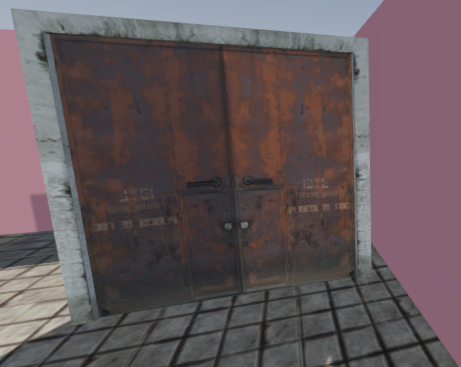

# SCHIZOID
A short psychological horror game about paranoia, identity, and office lights that hum at 3:17 AM.

##The conference room – or is it?

# The final interrogation.

## 🎮 Play the game
👉 **[Play now](https://YOUR_USERNAME.github.io/schizo-game/)** (replace with your actual GitHub Pages URL once it's live)

## 📖 Story
Milo suspects his coworkers aren't human. He's been tracking blinks, yawns, and the word "optimize". But when HR sits him down, the truth bends.

Full dialogue included – a slowly unraveling schizophrenic episode.

## 🛠️ How to run locally
1. Download this repository.
2. Open `index.html` in any browser.
3. No server needed – it's pure HTML/CSS/JS.

## 🧠 Credits
Written by [Lazar Tomic, Marko Zrnic and Marko Djordjevic]  

## 📦 Built for itch.io game jam
